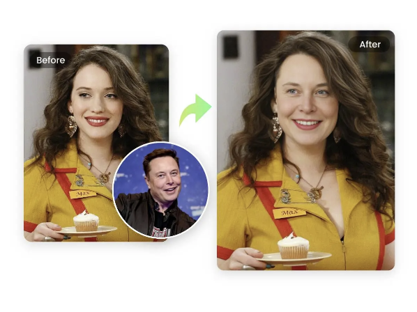
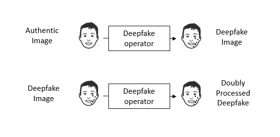
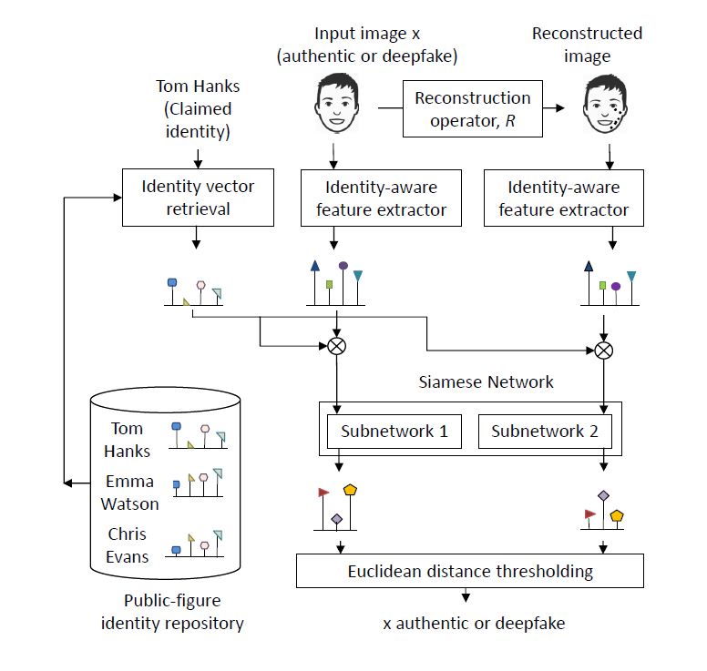
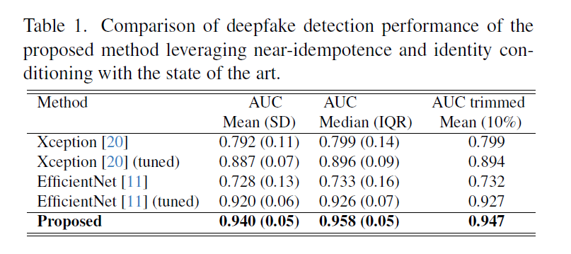

## Individualized Deepfake Detection Using Double Neural Network

### 1. Individualized detection

The majority of the victims of the deepfake attacks are the celebrities as shown below. (Photo credit: <a href="https://www.fotor.com/features/face-swap/">Fotor</a>)



Individualized deepfake detection converts the question "Is this image a deepfake?" to "Is this image a deepfake of that celebrity"? The extra information can help the detection system.

### 2. Double Neural Network



Let us say we have an image to test its authenticity. If we pass the image through a deepfake generator, then there are two possibilities:

1. The original image was authentic. The output will be a deepfake image. The deepfake operator adds deepfake traces to the image.

2. The original image was a deepfake image. Then the resulting image is a doubly processed image, as it has been passed by deepfake generator two times. The first deepfake operation was conducted by an attacker, and the second operation is conducted by us.

If we differentiate the deepfake traces before and after passing it the deepfake operator at our end, then the change is significant for authentic image and negligible for deepfake image.


## Detection Network

We suggest employing a Siamese network in the detection network which is tailored to identify subtle distinctions between the features before and after the extra deepfake operation. We also use an identity-aware feature extractor instead of generalized feature extractor to better utilize the identity information.



## Documentation

#### Python environment

Create a conda environment as below:

```
conda create --name double_op python=3.8.15 -y
conda activate double_op
conda install pytorch torchvision pytorch-cuda=11.8 -c pytorch -c nvidia -y
conda install matplotlib -y
conda install scipy -y
pip install opencv-python efficientnet-pytorch albumentations scikit-learn pandas tqdm tensorboardX h5py pyqt6
```
The dependency is listed in the ```requirements.txt``` file.

#### Re-generate The Results Of The Paper

```
tar -xzvf required-final.tar.gz -C ./
cd siamese_detector
python proposed_method_test.py
```
Before running the above script, please download ```required-final.tar.gz``` from the <a href="https://drive.google.com/drive/folders/1pHgGdZsf9cTgPd2mqrFOGU9HuSwcsOn4?usp=drive_link">data repository</a> and keep it inside ```deepfake_op_rel/``` folder.

The script uses trained siamese models stored in ```siamese_detector/trained_weight``` folder.

#### Training The Siamese Network
```
tar -xzvf required-final.tar.gz -C ./
cd siamese_detector
python proposed_method_train.py
```

Before running the above script, please download ```required-final.tar.gz``` from the <a href="https://drive.google.com/drive/folders/1pHgGdZsf9cTgPd2mqrFOGU9HuSwcsOn4?usp=drive_link">data repository</a> and keep it inside ```deepfake_op_rel/``` folder.

#### Generating The Features From Scratch

The authentic and deepfake images are available in the <a href="https://drive.google.com/drive/folders/1pHgGdZsf9cTgPd2mqrFOGU9HuSwcsOn4?usp=drive_link">data repository</a>. If you want to extract the features of your own please run the below scripts.

```
cd deepfake_op_rel
mkdir faces
tar -xzvf celebdf.tar.gz -C ./faces/
tar -xzvf celebdf_recons.tar.gz -C ./faces/
tar -xzvf celebdf_double_recons.tar.gz -C ./faces/
tar -xzvf cacd_auth.tar.gz -C ./faces/
tar -xzvf cacd_auth_recons.tar.gz -C ./faces/
tar -xzvf cacd_deepfake.tar.gz -C ./faces/
tar -xzvf cacd_deepfake_recons.tar.gz -C ./faces/
unzip finetuned-on-compact-train-swapped.zip
mkdir regenerated-feature-folder
cd siamese_detector
python prepare_features_train_data.py
python prepare_features_test_data.py
```

#### Training The Identity Aware Backbone

The identity aware feature extractor can be trained as below.

```
tar -xzvf flr_r50_vgg_face.tar.gz -C siamese_detector/models
tar -xzvf finetuned-backbone.tar.gz -C ./
tar -xzvf compact-train-swapped.tar.gz -C ./
cd identity_aware_feature_extractor
conda activate double_op
python main-transfer-learning.py
```
Before running the above script, please download the training data ```compact-train-swapped.tar.gz``` and initial weights ```finetuned-backbone.zip``` and ```flr_r50_vgg_face.tar.gz``` from the data repository.

#### Comparing With Tuned Baseline Methods

To compare with the tuned baseline methods, run the below scripts:
```
conda activate double_op
tar -xzvf feature-efficientnet.tar.gz -C ./
tar -xzvf feature-xception.tar.gz -C ./
cd siamese_detector
python baseline_efficientnet_tuning.py
python baseline_xception_tuning.py
```
Before running the above script, please download ```feature-efficientnet.tar.gz``` and ```feature-xception.tar.gz``` from the <a href="https://drive.google.com/drive/folders/1pHgGdZsf9cTgPd2mqrFOGU9HuSwcsOn4?usp=drive_link">data repository</a> and keep it inside ```deepfake_op_rel/``` folder.

## Results



## Add new identity

Our model is trianed for 45 identities. The indentity list is available in the ```celebrity_list.txt``` file. To add a new identity please follow the below procedure:

Locate to the ```faceswap``` folder. Copy the trianing and testing images of a new celebrity to the ```new_ids``` folder under new a numeric id that does not exist within the ```id_celebdf``` column of ```celebrity_list.txt```. The values of ```id_celebdf``` ranges between 1 and 61. So, it is safe to start after 61 to avoid unintentional duplication of identity number. For example, to add a new identity with id 101 do the following:
```
cd faceswap
cp -r path_to_the_training_celebrity_images/* new_ids/101/train/
cp -r path_to_the_test_celebrity_images/* new_ids/101/test/
```

Get a system with NVIDIA 10XX series GPU, i.e., GTX 1080 Ti. Create a conda environment with python 3.6.4, tensorflow 1.8.0 and keras 2.1.5. This specific setup is required for training the <a fref="https://github.com/shaoanlu/faceswap-GAN">Faceswap-GAN</a> architecture. The full library list is available in ```faceswap/requirements.txt``` file.

Activate the conda environment and run the below scripts editing the new identity number. Given code assumes that two new identities 101 and 102 are being added. Change the line 347 of ```extract_faces.py``` and line 66 of ```extraact_eyes.py``` to make desired changes.
```
conda activate faceswap
cd faceswap
python extract_faces.py
python extract_eyes.py
```
After running the scripts you should find the facial images of new identity within ```deepfake_op_rel/faces/faces_celebdf``` folder and eye masks within ```deepfake_op_rel/faces/binary_masks-celebdf``` folder. Similarly extracted faces and eye masks from test images will be available within ```deepfake_op_rel/faces/faces_cacd``` and ```deepfake_op_rel/faces/binary_masks-cacd``` folders.

To train the reconstructor models using only trianing images run the below script after updating the identity numbers in line 85:
```python gen_train_celebdf.py```

If you want to generate faceswapped images from the test images using Faceswap-GAN architecture, run the below script after updating line 97 and 101:
```python gen_train_AtoB_cacd.py```

Then generate the reconstructed images, doubly reconstructed images and test faceswapped images run the below script three times for each of the tasks updating the lines from 473 to 498.
```python gen_run.py```
After this step you should have all types of reconstructed images for newly added identities within ```deepfake_op_rel/faces/``` folder.
## Citation

If you use our code, please cite our <a href="https://arxiv.org/abs/2312.08034">paper</a>:

@article{rahman2023individualized,<br>
  &ensp;&ensp;title={Individualized Deepfake Detection Exploiting Traces Due to Double Neural-Network Operations},<br>
  &ensp;&ensp;author={Rahman, Mushfiqur and Liu, Runze and Wong, Chau-Wai and Dai, Huaiyu},<br>
  &ensp;&ensp;journal={arXiv preprint arXiv:2312.08034},<br>
  &ensp;&ensp;year={2023}<br>
}

